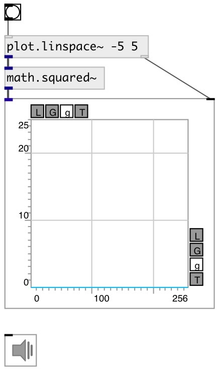

[index](index.html) :: [math](category_math.html)
---

# math.squared~

###### signal value square

*available since version:* 0.9

---

## inlets:

* input signal 
__type:__ audio 

## outlets:

* output signal
__type:__ control 

## keywords:

[math](keywords/math.html)
[square](keywords/square.html)

**Authors:** Serge Poltavsky

**License:** GPL3 or later

