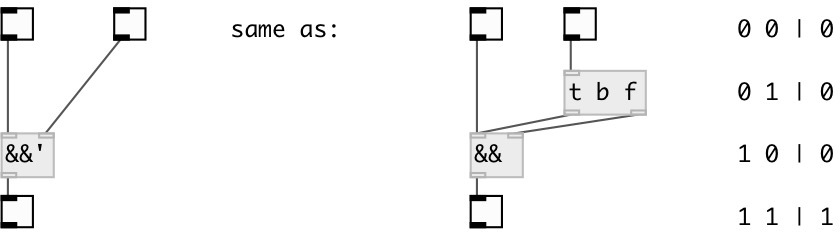

[index](index.html) :: [math](category_math.html)
---

# math.sync_and
**aliases:** [math.&amp;&amp;&#39;], [ceammc/&amp;&amp;&#39;], [&amp;&amp;&#39;]

###### sync logical AND operation

*available since version:* 0.8

---

## information
Only 1 and 0 values are accepted. Any other number treat as 1, but print error to console.

## arguments:

* **V**
second value 
_type:_ int 

## inlets:

* set first value, calculate and output result 
_type:_ control
* change second value, calculate and output result 
_type:_ control

## outlets:

* output 1 or 0, according logical AND operation 
_type:_ control

## keywords:

[math](keywords/math.html)
[sync](keywords/sync.html)
[logical](keywords/logical.html)
[and](keywords/and.html)

**See also:**
[\[math.||&#39;\]](math.%7C%7C%27.html)

**Authors:** Serge Poltavsky

**License:** GPL3 or later

