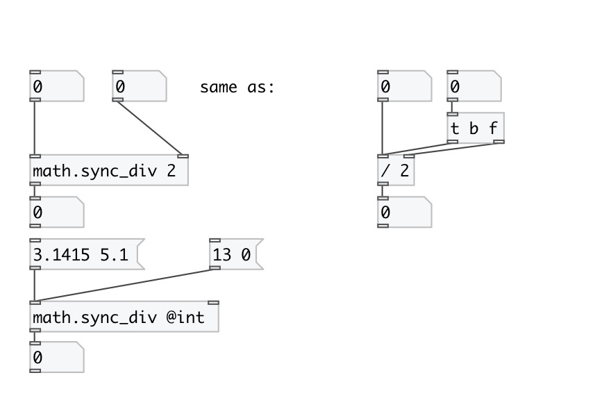

[< reference home](index.html)
---

# math.sync_div

sync division

---

on division by zero outputs nothing: just put error message into console
 

---

---
arguments:

DIV: divisor 

---
properties:

@int: operate on integers only 

