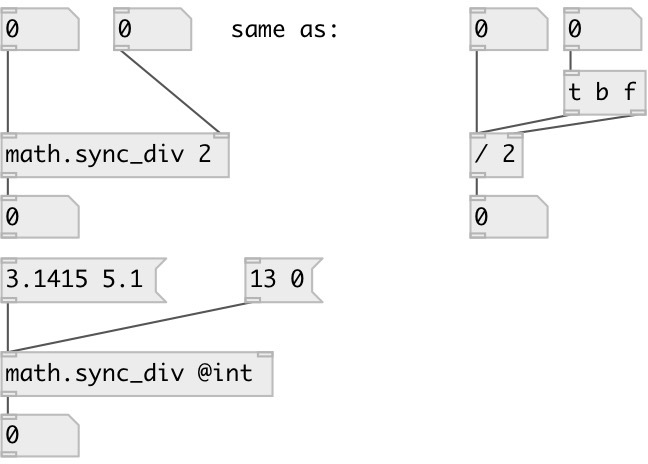

[index](index.html) :: [math](category_math.html)
---

# math.sync_div

###### sync division

*available since version:* 0.8

---

## information
on division by zero outputs nothing: just put error message into console

## arguments:

* **DIV**
divisor 
__type:__ float 

## properties:

* **@int** 
Get/set operate on integers only 
__type:__ flag 
__default:__ 0 

## inlets:

* set divident, calculate and output result 
__type:__ control 
* change divisor, calculate and output result 
__type:__ control 

## outlets:

* division result
__type:__ control 

## keywords:

[math](keywords/math.html)
[division](keywords/division.html)
[sync](keywords/sync.html)

**Authors:** Serge Poltavsky

**License:** GPL3 or later

