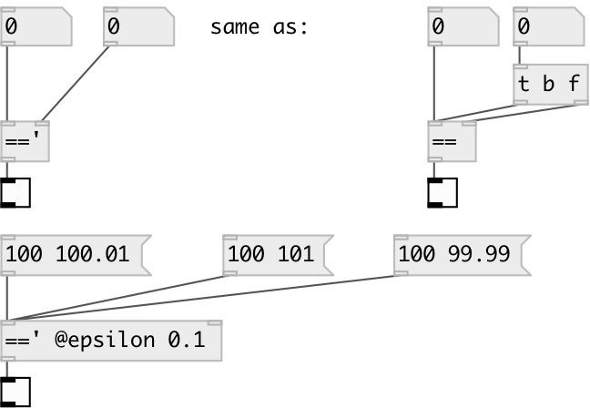

[index](index.html) :: [math](category_math.html)
---

# math.sync_eq

###### sync equal numbers check

*available since version:* 0.8

---

## arguments:

* **F**
second number 
__type:__ float 

## properties:

* **@epsilon** 
Get/set compare epsilon. If not zero calculates expession: -epsilon &lt; abs(A-B) &lt;
+epsilon 
__type:__ float 
__min value:__ 0 
__default:__ 0 

## inlets:

* set first number, calculate and output result 
__type:__ control 
* change second number, calculate and output result 
__type:__ control 

## outlets:

* result output: 1 if numbers are equal otherwise 0
__type:__ control 

## keywords:

[math](keywords/math.html)
[sync](keywords/sync.html)
[equal](keywords/equal.html)

**See also:**
[\[math.!=&#39;\]](math.%21%3D%27.html)

**Authors:** Serge Poltavsky

**License:** GPL3 or later

