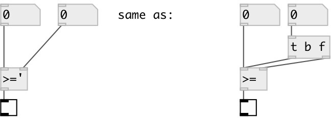

[index](index.html) :: [math](category_math.html)
---

# math.sync_ge

###### sync greater equal numbers compare

*available since version:* 0.8

---

## arguments:

* **F**
second number 
__type:__ float 

## inlets:

* set first number, calculate and output result 
__type:__ control 
* change second number, calculate and output result 
__type:__ control 

## outlets:

* result output: 1 if first number is greater or equal second, otherwise
            0
__type:__ control 

## keywords:

[math](keywords/math.html)
[sync](keywords/sync.html)
[greater](keywords/greater.html)
[equal](keywords/equal.html)
[compare](keywords/compare.html)

**See also:**
[\[math.&lt;=&#39;\]](math.%3C%3D%27.html)

**Authors:** Serge Poltavsky

**License:** GPL3 or later

