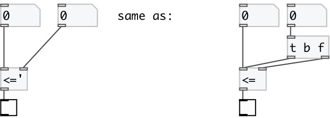

[index](index.html) :: [math](category_math.html)
---

# math.sync_le
**aliases:** [math.&lt;=&#39;], [ceammc/&lt;=&#39;], [&lt;=&#39;]

###### sync less equal numbers compare

*available since version:* 0.8

---

## arguments:

* **F**
second number 
_type:_ float 

## inlets:

* set first number, calculate and output result 
_type:_ control
* change second number, calculate and output result 
_type:_ control

## outlets:

* result output: 1 if first number is less or equal second, otherwise 0 
_type:_ control

## keywords:

[math](keywords/math.html)
[sync](keywords/sync.html)
[less](keywords/less.html)
[equal](keywords/equal.html)
[compare](keywords/compare.html)

**See also:**
[\[math.&gt;=&#39;\]](math.%3E%3D%27.html)

**Authors:** Serge Poltavsky

**License:** GPL3 or later

