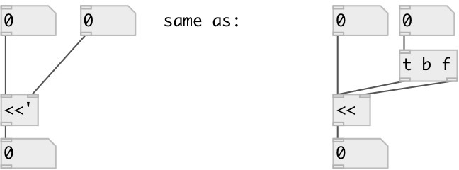

[index](index.html) :: [math](category_math.html)
---

# math.sync_lshift
**aliases:** [math.&lt;&lt;&#39;], [ceammc/&lt;&lt;&#39;], [&lt;&lt;&#39;]

###### sync signed bit left shift

*available since version:* 0.9.1

---

## arguments:

* **SHIFT**
shift amount 
_type:_ int 

## inlets:

* set value, calculate and output result 
_type:_ control
* change shift, calculate and output result 
_type:_ control

## outlets:

* result output 
_type:_ control

## keywords:

[math](keywords/math.html)
[shift](keywords/shift.html)
[sync](keywords/sync.html)

**See also:**
[\[math.sync_rshift\]](math.sync_rshift.html)

**Authors:** Serge Poltavsky

**License:** GPL3 or later

