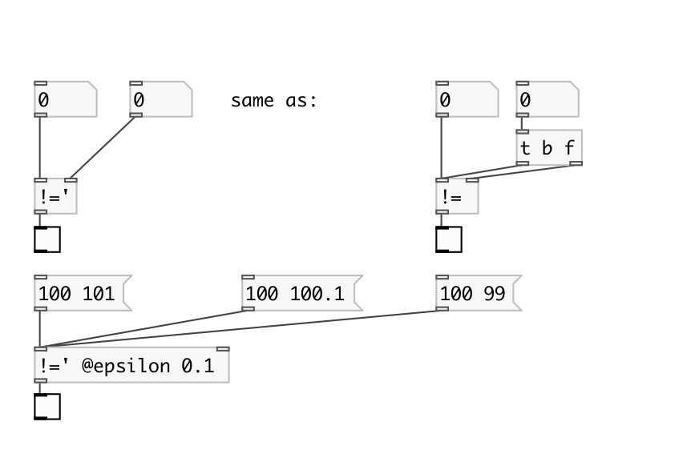

[< reference home](index.html)
---

# math.sync_ne

sync numbers for not equality

---

 

---

---
arguments:

F: second number 

---
properties:

@epsilon: compare epsilon. If not
            zero calculates expession: !(-epsilon &lt; abs(A-B) &lt; +epsilon) 

---
see also: 

