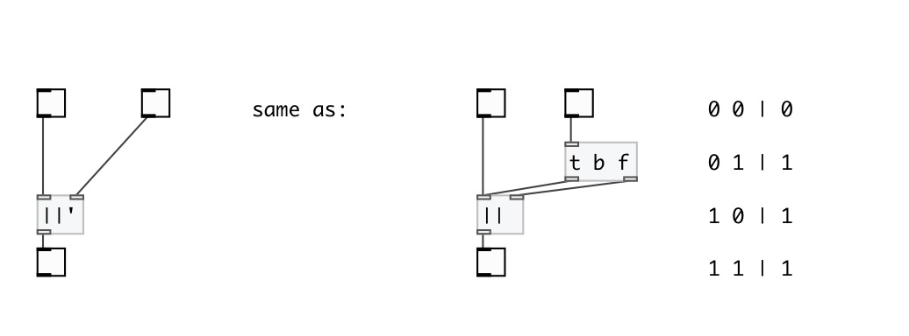

[< reference home](index.html)
---

# math.sync_or

sync logical OR operation

---

Only 1 and 0 values are accepted. Any other number treat as 1, but print error to
            console.
 

---

---
arguments:

V: second value 

---
properties:

---
see also: 

