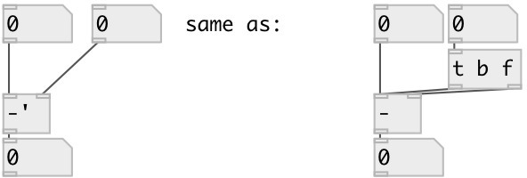

[index](index.html) :: [math](category_math.html)
---

# math.sync_sub
**aliases:** [math.-&#39;], [ceammc/-&#39;], [-&#39;]

###### sync subtraction

*available since version:* 0.8

---

## arguments:

* **F**
subtrahend 
_type:_ float 

## properties:

* **@int** (initonly)
Get/set operate on integers only 
_type:_ flag 
_default:_ 0 

## inlets:

* set minuend, calculate and output result 
_type:_ control
* change subtrahend, calculate and output result 
_type:_ control

## outlets:

* difference output 
_type:_ control

## keywords:

[math](keywords/math.html)
[sub](keywords/sub.html)
[sync](keywords/sync.html)

**See also:**
[\[math.sync_add\]](math.sync_add.html)

**Authors:** Serge Poltavsky

**License:** GPL3 or later

