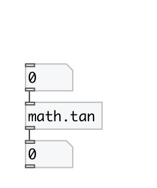

[index](index.html) :: [math](category_math.html)
---

# math.tan

###### tangent function

*available since version:* 0.1

---

## information
The tan() function computes the tangent of x (measured in radians).
Special values:
tan(+-0) returns +-0.
tan(+-infinity) returns a NaN and raises the &#34;invalid&#34; floating-point
            exception.

## inlets:

* input value 
__type:__ control 

## outlets:

* result value
__type:__ control 

## keywords:

[math](keywords/math.html)
[tan](keywords/tan.html)

**See also:**
[\[math.acos\]](math.acos.html)
[\[math.asin\]](math.asin.html)
[\[math.atan\]](math.atan.html)

**Authors:** Serge Poltavsky

**License:** GPL3 or later

