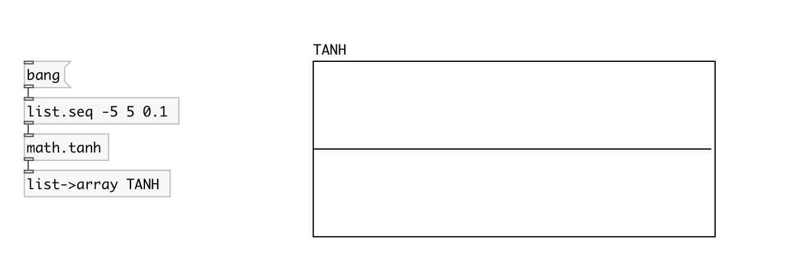

[< reference home](index.html)
---

# math.tanh

hyperbolic tangent function

---

The tanh() function computes the hyperbolic tangent of x.
Special values:
tanh(+-0) returns +-0.
tanh(+-infinity) returns +-1.
 

---

---
arguments:

---
properties:

---
see also: 

