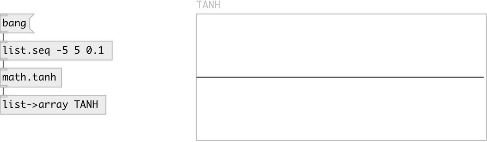

[index](index.html) :: [math](category_math.html)
---

# math.tanh

###### hyperbolic tangent function

*available since version:* 0.1

---

## information
The tanh() function computes the hyperbolic tangent of x. Special values: tanh(+-0) returns +-0. tanh(+-infinity) returns +-1.

## inlets:

* input value 
_type:_ control

## outlets:

* result value 
_type:_ control

## keywords:

[math](keywords/math.html)
[tanh](keywords/tanh.html)

**See also:**
[\[math.acos\]](math.acos.html)
[\[math.asin\]](math.asin.html)
[\[math.atan\]](math.atan.html)

**Authors:** Serge Poltavsky

**License:** GPL3 or later

