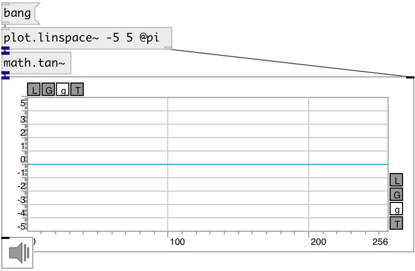

[index](index.html) :: [math](category_math.html)
---

# math.tan~

###### tangent function

*available since version:* 0.9

---

## information
Outputs the tangent of x (measured in radians).

## inlets:

* input signal 
_type:_ audio

## outlets:

* result signal 
_type:_ audio

## keywords:

[math](keywords/math.html)
[tan](keywords/tan.html)

**See also:**
[\[math.tan~\]](math.tan~.html)
[\[math.asin\]](math.asin.html)
[\[math.atan\]](math.atan.html)

**Authors:** Serge Poltavsky

**License:** GPL3 or later

