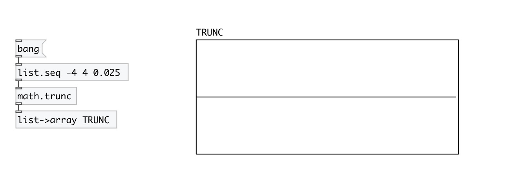
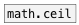
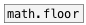
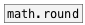

[< reference home](index.html)
---

# math.trunc

truncate to integer value

---

Outputs the integral value nearest to but no larger in magnitude than x
 

---

---
arguments:

---
properties:

---
see also: 

