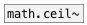

[<<< reference home](ceammc_lib.md)
---

# math.trunc~

```


[bang(
|
[plot.linspace~ -3 3 #a]
|             |
[math.trunc~] [math.floor~]
|             |.
[ui.plot~ @ymin_ticks 0 @xlabels 1 @ylabels 1 @ymin -3 @ymax 3 @size 260 260 @n 2 #b]


[ui.dsp~]
[X a:1->b:2]

            
```
---
truncate to integer value
---
arguments:


---
properties:


---
see also:<br>
[](math.trunc.md)
[](math.ceil~.md)
[](math.round~.md)
