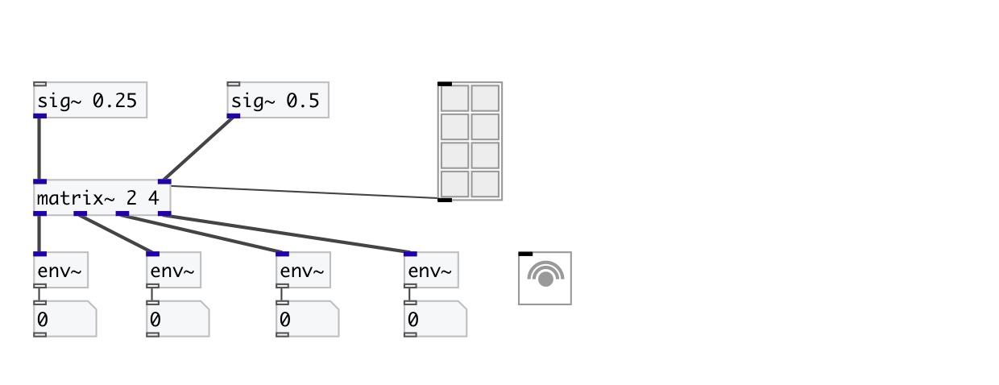

[< reference home](index.html)
---

# matrix~

signal routing matrix

---

 

---

---
arguments:

INS: number of matrix inputs
            (columns) 
OUTS: number of matrix outputs
            (rows) 

---
properties:

@inputs: number of matrix inputs 
@outputs: number of matrix outputs 

