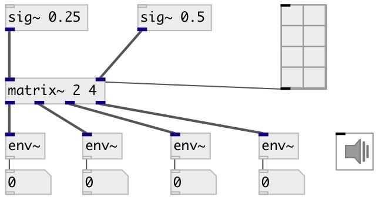

[index](index.html) :: [base](category_base.html)
---

# matrix~
**aliases:** [ceammc/matrix\~]

###### signal routing matrix

*available since version:* 0.6

---

## arguments:

* **INPUTS**
number of matrix inputs (columns) 
_type:_ int 

* **OUTPUTS**
number of matrix outputs (rows) 
_type:_ int 

## methods:

* **cell**
on/off matrix cell. Note argument order: row, cols. 
  __parameters:__
  - **ROW** row (output) index 
    type: int  
    required: True  

  - **COL** column (input) index 
    type: int  
    required: True  

## properties:

* **@inputs** (initonly)
Get/set number of matrix inputs 
_type:_ int 
_range:_ 2..16 
_default:_ 2 

* **@outputs** (initonly)
Get/set number of matrix outputs 
_type:_ int 
_range:_ 2..16 
_default:_ 2 

## inlets:

* first input signal 
_type:_ audio
* ... input signal 
_type:_ audio
* n-th input signal 
_type:_ audio

## outlets:

* first output signal 
_type:_ audio
* ... output signal 
_type:_ audio
* n-th output signal 
_type:_ audio

## keywords:

[matrix](keywords/matrix.html)

**Authors:** Serge Poltavsky

**License:** GPL3 or later

