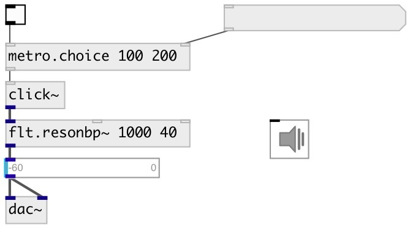

[index](index.html) :: [base](category_base.html)
---

# metro.choice

###### metro with random choice from timeset

*available since version:* 0.9.7

---

## information
Random distribution: uniform

## arguments:

* **TIMESET**
timeset (&gt;0) 
_type:_ list 
_units:_ ms 

## properties:

* **@timeset** 
Get/set timeset (&gt;0) 
_type:_ list 
_units:_ ms 

* **@seed** 
Get/set generator seed 
_type:_ int 
_min value:_ 0 
_default:_ 0 

## inlets:

* starts (on &gt;0) or stops (on &lt;=0) metro 
_type:_ control
* set timeset 
_type:_ control

## outlets:

* outputs *bang* 
_type:_ control

## keywords:

[metro](keywords/metro.html)
[random](keywords/random.html)

**See also:**
[\[metro.random\]](metro.random.html)
[\[metro.pattern\]](metro.pattern.html)

**Authors:** Serge Poltavsky

**License:** GPL3 or later

