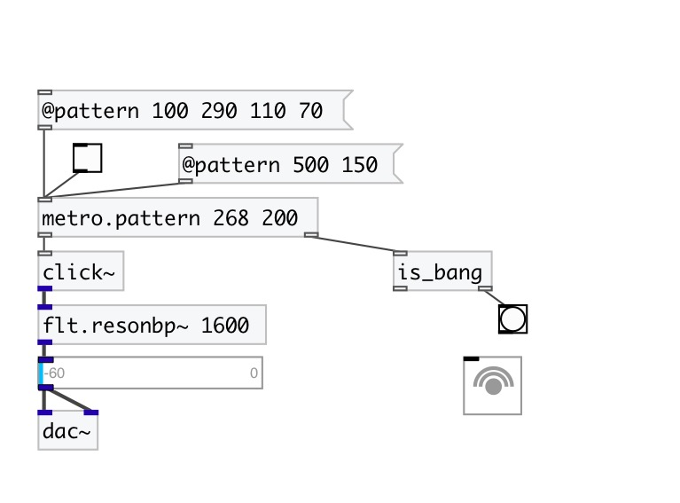

[< reference home](index.html)
---

# metro.pattern

metro with rhythmic patterns

---

 

---

---
arguments:

PATTERN: list of time intervals 

---
properties:

@pattern: time intervals performed in a loop 
@current: current pattern
            index 
@sync: sync mode - change pattern
            after full cycle 

---
see also: 

