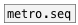

[<<< reference home](ceammc_lib.md)
---

# metro.pattern

```


[@pattern 100 290 110 70(
|
| [T]   [@pattern 500 150(
| |     |
[metro.pattern 268 200]
|                   ^|
[click~]            [is_bang]
|                         ^|
[flt.resonbp~ 1600]       [B]
|
[ui.gain~ @size 120 16] [ui.dsp~]
| \
[dac~]

            
```
---
metro with rhythmic patterns
---
arguments:

PATTERN: list of time intervals<br>

---
properties:

@pattern: time intervals performed in a loop<br>
@current: current pattern
            index<br>
@sync: sync mode - change pattern
            after full cycle<br>

---
see also:<br>
[](metro.md)
[](metro.seq.md)
