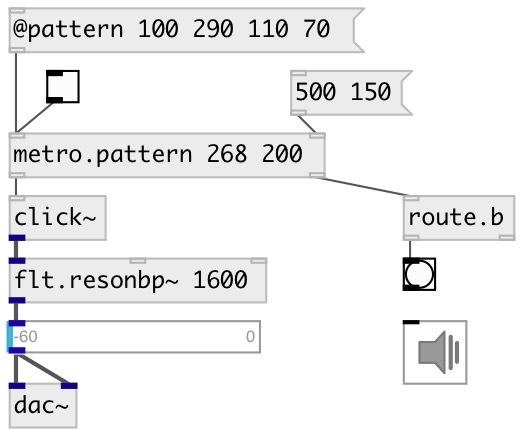

[index](index.html) :: [base](category_base.html)
---

# metro.pattern

###### metro with rhythmic patterns

*available since version:* 0.5

---

## arguments:

* **PATTERN**
list of time intervals (in ms) 
_type:_ list 

## properties:

* **@pattern** 
Get/set time intervals (in ms) performed in a loop 
_type:_ list 

* **@current** 
Get/set current pattern index 
_type:_ int 
_min value:_ 0 
_default:_ 0 

* **@sync** 
Get/set sync mode - change pattern after full cycle 
_type:_ bool 
_default:_ 0 

## inlets:

* starts (on 1) or stops (on 0) metro 
_type:_ control

## outlets:

* outputs *bang* 
_type:_ control
* outputs current pattern index and bang on loop return 
_type:_ control

## keywords:

[metro](keywords/metro.html)
[pattern](keywords/pattern.html)
[rhythm](keywords/rhythm.html)

**See also:**
[\[metro\]](metro.html)
[\[metro.seq\]](metro.seq.html)

**Authors:** Serge Poltavsky

**License:** GPL3 or later

