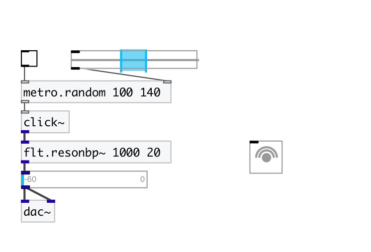
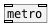

[< reference home](index.html)
---

# metro.random

metro random bang with specified range

---

Random distribution: uniform
 

---

---
arguments:

MIN(ms): minimal bang
            interval 
MAX(ms): maximum bang
            interval 

---
properties:

@min(ms): minimal
            bang interval 
@max(ms): maximum
            bang interval 

---
see also: 

