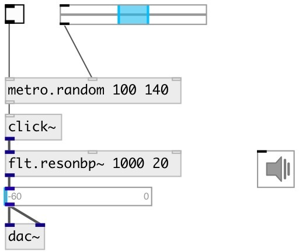

[index](index.html) :: [base](category_base.html)
---

# metro.random

###### metro random bang with specified range

*available since version:* 0.9

---

## information
Random distribution: uniform

## arguments:

* **MIN**
minimal bang interval 
_type:_ int 
_units:_ ms 

* **MAX**
maximum bang interval 
_type:_ int 
_units:_ ms 

## properties:

* **@min** 
Get/set minimal bang interval 
_type:_ int 
_units:_ ms 
_min value:_ 1 
_default:_ 100 

* **@max** 
Get/set maximum bang interval 
_type:_ int 
_units:_ ms 
_min value:_ 1 
_default:_ 200 

* **@seed** 
Get/set generator seed 
_type:_ int 
_min value:_ 0 
_default:_ 0 

## inlets:

* starts (on &gt; 0) or stops (on &lt;= 0) metro 
_type:_ control
* set @min property 
_type:_ control
* set @max property 
_type:_ control

## outlets:

* outputs *bang* 
_type:_ control

## keywords:

[metro](keywords/metro.html)
[random](keywords/random.html)

**See also:**
[\[metro\]](metro.html)
[\[metro.pattern\]](metro.pattern.html)

**Authors:** Serge Poltavsky

**License:** GPL3 or later

