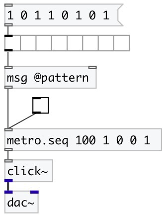

[index](index.html) :: [base](category_base.html)
---

# metro.seq

###### metro sequencer

*available since version:* 0.5

---

## information
Easy way to build beat machines

## arguments:

* **INTERVAL**
metro tempo in ms 
_type:_ float 
_units:_ ms 

* **PATTERN**
list of 1 and 0. Where 1 means output bang on this beat 
_type:_ list 

## properties:

* **@pattern** 
Get/set list of 1 and 0. Where 1 means output bang on this beat 
_type:_ list 

* **@interval** 
Get/set interval between beats 
_type:_ float 
_units:_ ms 
_min value:_ 1 
_default:_ 0 

* **@current** 
Get/set current pattern index 
_type:_ int 
_min value:_ 0 
_default:_ 0 

## inlets:

* starts (on 1) or stops (on 0) metro 
_type:_ control

## outlets:

* outputs *bang* 
_type:_ control

## keywords:

[metro](keywords/metro.html)
[sequencer](keywords/sequencer.html)

**See also:**
[\[metro\]](metro.html)
[\[metro.pattern\]](metro.pattern.html)

**Authors:** Serge Poltavsky

**License:** GPL3 or later

