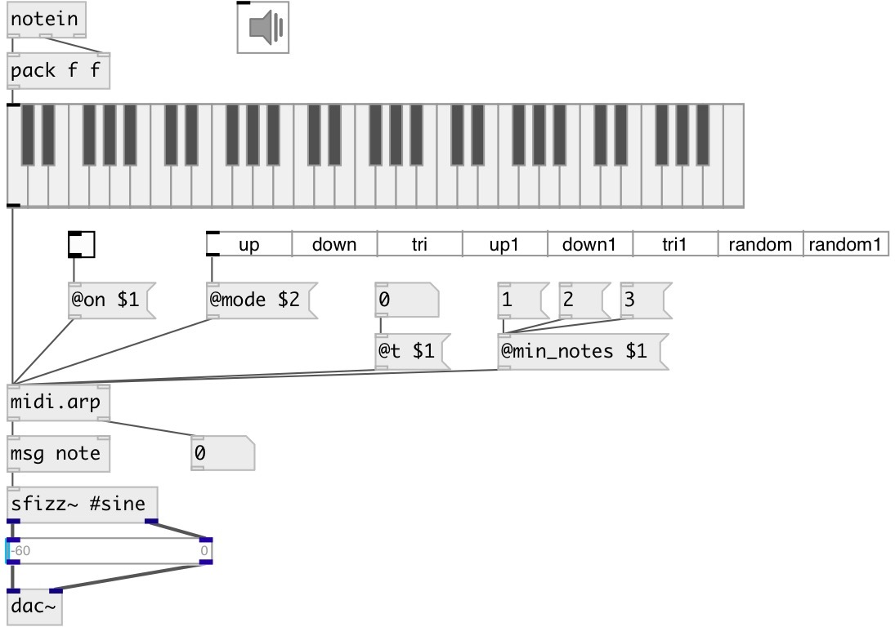

[index](index.html) :: [midi](category_midi.html)
---

# midi.arp

###### MIDI arpeggiator

*available since version:* 0.9.6

---

## information
&#39;up&#39; - play notes from bottom to up &#39;down&#39; - play from top to bottom &#39;tri&#39; - play from bottom to up and then back &#39;up1&#39; - play top note, then from bottom to up &#39;down1&#39; - play bottom note, then from top to bottom &#39;tri1&#39; - play from up to bottom, then back &#39;random&#39; - play random note, excluding the current one (no repeats) &#39;random1&#39; - play random note (there can be repeats)

## arguments:

* **T**
time between arpeggio 
_type:_ float 
_units:_ ms 

## properties:

* **@t** 
Get/set time between arpeggio 
_type:_ float 
_units:_ ms 
_range:_ 1..1000 
_default:_ 100 

* **@mode** 
Get/set argpeggiator mode 
_type:_ symbol 
_enum:_ up, down, tri, up1, down1, tri1, random, random1 
_default:_ up 

* **@seed** 
Get/set random seed value (to get reproducible random series) 
_type:_ int 
_min value:_ 0 
_default:_ 0 

* **@external** 
Get/set use external clock 
_type:_ bool 
_default:_ 0 

* **@min_notes** 
Get/set number of minimal notes to perform arpeggio 
_type:_ int 
_min value:_ 1 
_default:_ 1 

* **@on** 
Get/set arpeggiator state: on/off 
_type:_ bool 
_default:_ 1 

* **@pass** 
Get/set bypass arpeggiator 
_type:_ bool 
_default:_ 0 

## inlets:

* NOTE VELOCITY 
_type:_ control
* play next note in chord, if @external = 1 
_type:_ control

## outlets:

* list: NOTE VELOCITY 
_type:_ control
* int: note index in chord 
_type:_ control

## keywords:

[midi](keywords/midi.html)
[arpeggiator](keywords/arpeggiator.html)

**Authors:** Serge Poltavsky

**License:** GPL3 or later

