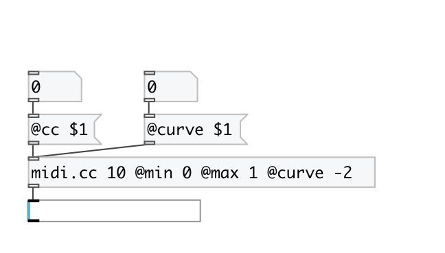

[index](index.html) :: [midi](category_midi.html)
---

# midi.cc

###### enhanced version of vanilla ctlin

*available since version:* 0.9.2

---

## arguments:

* **CC**
controller number 
_type:_ int 

* **MIN**
@min value 
_type:_ float 

* **MAX**
@max value 
_type:_ float 

## properties:

* **@cc** 
Get/set controller number 
_type:_ int 
_range:_ 0..127 
_default:_ 0 

* **@ch** 
Get/set MIDI channel 
_type:_ int 
_range:_ 0..16 
_default:_ 0 

* **@min** 
Get/set output value at midi input == 0 
_type:_ float 
_default:_ 0 

* **@max** 
Get/set output value at midi input == 127 
_type:_ float 
_default:_ 127 

* **@curve** 
Get/set output curve. If @curve0: slow begin, fast end, if @curve==0: linear speed 
_type:_ float 
_default:_ 0 

## inlets:

* control input 
_type:_ control

## outlets:

* float value 
_type:_ control

## keywords:

[midi](keywords/midi.html)
[controller](keywords/controller.html)
[name](keywords/name.html)
[cc](keywords/cc.html)
[ctlin](keywords/ctlin.html)

**Authors:** Serge Poltavsky

**License:** GPL3 or later

