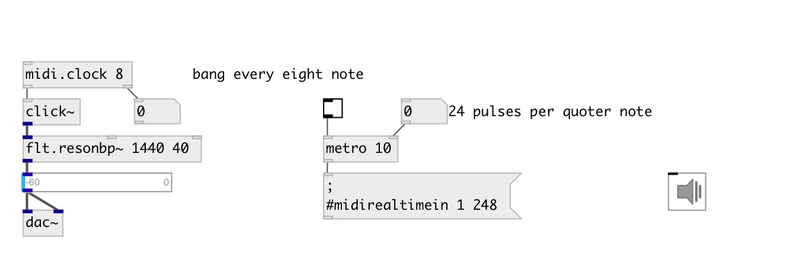

[index](index.html) :: [midi](category_midi.html)
---

# midi.clock

###### midi clock toolbox

*available since version:* 0.9.2

---

## information
Note: cause in Pd messages are processed between DSP blocks - measured bpm is not
            exact

## arguments:

* **DIV**
@div clock subdivision 
__type:__ int 

## methods:

* **reset**
reset beat counter 

## properties:

* **@div** 
Get/set clock subdivision. If 0: bang each incoming midi clock message, if 4: output
every quoter note, 8: every eight note etc. 
__type:__ int 
__enum:__ 0, 4, 8, 16, 32 
__default:__ 0 

## inlets:

* control input 
__type:__ control 

## outlets:

* bang: on specified beat
__type:__ control 
* float: measured bpm (output every beat)
__type:__ control 

## keywords:

[midi](keywords/midi.html)
[clock](keywords/clock.html)

**Authors:** Serge Poltavsky

**License:** GPL3 or later

