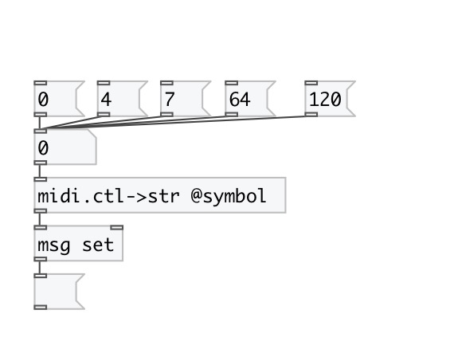

[< reference home](index.html)
---

# midi.ctl2str

convert Standard MIDI Controllers number to name

---

 

---

---
arguments:

---
properties:

@symbol: output as symbol instead of string by
            default 

