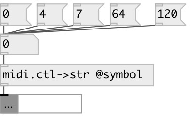

[index](index.html) :: [midi](category_midi.html)
---

# midi.ctl2str

###### convert Standard MIDI Controllers number to name

*available since version:* 0.4

---

## properties:

* **@symbol** 
Get/set output as symbol instead of string by default 
__type:__ flag 
__default:__ 0 

## inlets:

* Standart MIDI controller number [0-127] 
__type:__ control 

## outlets:

* output Standart MIDI controller name (string or symbol)
__type:__ control 

## keywords:

[midi](keywords/midi.html)
[controller](keywords/controller.html)
[name](keywords/name.html)

**Authors:** Serge Poltavsky

**License:** GPL3 or later

