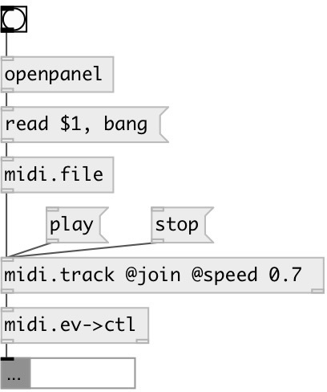

[index](index.html) :: [midi](category_midi.html)
---

# midi.event2ctl

###### convert MidiEvent message to controller channel/value pair

*available since version:* 0.4

---

## inlets:

* MidiEvent message 
__type:__ control 

## outlets:

* output pair: controller number, value
__type:__ control 
* track number
__type:__ control 

## keywords:

[midi](keywords/midi.html)
[event](keywords/event.html)
[control](keywords/control.html)

**Authors:** Serge Poltavsky

**License:** GPL3 or later

