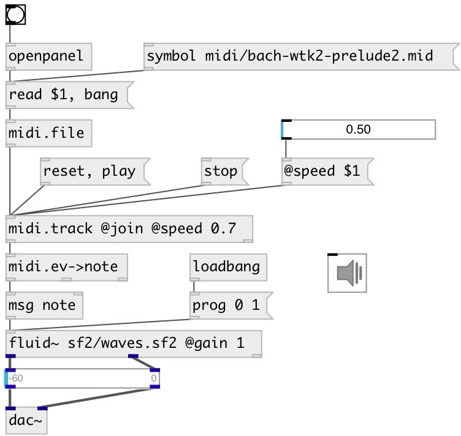

[index](index.html) :: [midi](category_midi.html)
---

# midi.event2note

###### convert MidiEvent message to midi note/velocity pair

*available since version:* 0.4

---

## inlets:

* MidiEvent message 
__type:__ control 

## outlets:

* output pair: note, velocity
__type:__ control 
* note duration in milliseconds
__type:__ control 
* note track
__type:__ control 

## keywords:

[midi](keywords/midi.html)
[track](keywords/track.html)

**Authors:** Serge Poltavsky

**License:** GPL3 or later

