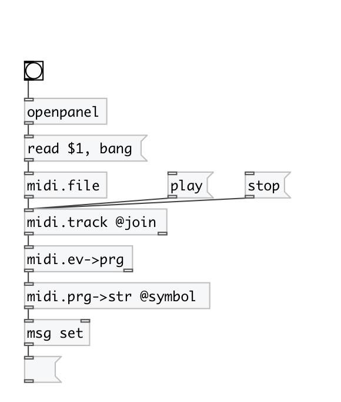

[index](index.html) :: [midi](category_midi.html)
---

# midi.event2prg

###### convert MidiEvent message to midi program change value

*available since version:* 0.4

---

## inlets:

* MidiEvent message 
__type:__ control 

## outlets:

* output MIDI patch number
__type:__ control 

## keywords:

[midi](keywords/midi.html)
[program](keywords/program.html)

**Authors:** Serge Poltavsky

**License:** GPL3 or later

