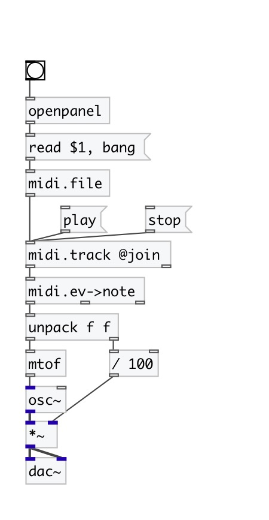

[< reference home](index.html)
---

# midi.file

standard midi file SMF reader and writer

---

 

---

---
arguments:

---
properties:

@filename: current filename 
@tracks: number of
            tracks 
@tempo: midi tempo in ticks
            per quarter 
@length_sec(sec): 
            file length 
@length_tick: file length on
            ticks 
@length_beat: file length in
            quarters 

