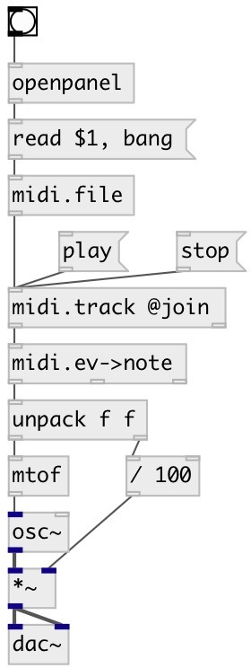

[index](index.html) :: [midi](category_midi.html)
---

# midi.file

###### standard midi file SMF reader and writer

*available since version:* 0.4

---

## methods:

* **read**
read specified midi file. No output 

* **write**
write to specified midi file 

* **clear**
removes all midi file content 

* **seek**
removes all midi file content 

* **reset**
removes all midi file content 

## properties:

* **@filename** 
Get/set current filename 
_type:_ symbol 

* **@tracks** (readonly)
Get number of tracks 
_type:_ int 
_default:_ 1 

* **@tempo** (readonly)
Get midi tempo in ticks per quarter 
_type:_ int 
_default:_ 120 

* **@length_sec** (readonly)
Get file length 
_type:_ float 
_units:_ sec 
_default:_ 0 

* **@length_tick** (readonly)
Get file length in ticks 
_type:_ int 
_default:_ 0 

* **@length_beat** (readonly)
Get file length in quarters 
_type:_ float 
_default:_ 0 

## inlets:

* output MidiFile data type 
_type:_ control

## outlets:

* MidiFile data type 
_type:_ control

## keywords:

[midi](keywords/midi.html)
[file](keywords/file.html)

**Authors:** Serge Poltavsky

**License:** GPL3 or later

