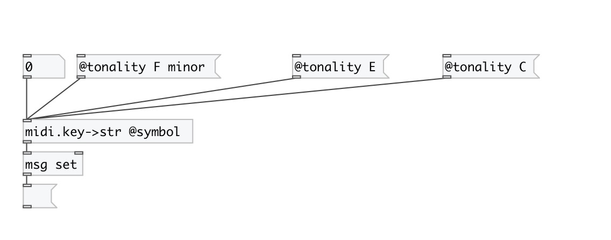

[< reference home](index.html)
---

# midi.key2str

convert key number to SPN name according to tonality

---

 

---

---
arguments:

---
properties:

@symbol: output as symbol instead of string by
            default 
@tonality: current tonality 

