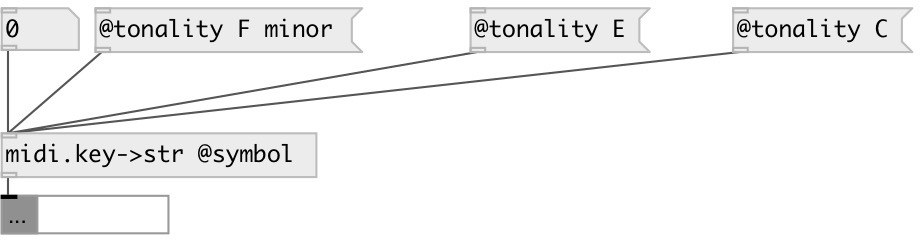

[index](index.html) :: [midi](category_midi.html)
---

# midi.key2str

###### convert key number to SPN name according to tonality

*available since version:* 0.4

---

## properties:

* **@symbol** 
Get/set output as symbol instead of string by default 
__type:__ flag 
__default:__ 0 

* **@tonality** 
Get/set current tonality 
__type:__ symbol 
__default:__ C major 

## inlets:

* standart MIDI key number [0-127] 
__type:__ control 

## outlets:

* output key name
__type:__ control 

## keywords:

[midi](keywords/midi.html)
[key](keywords/key.html)
[name](keywords/name.html)

**Authors:** Serge Poltavsky

**License:** GPL3 or later

