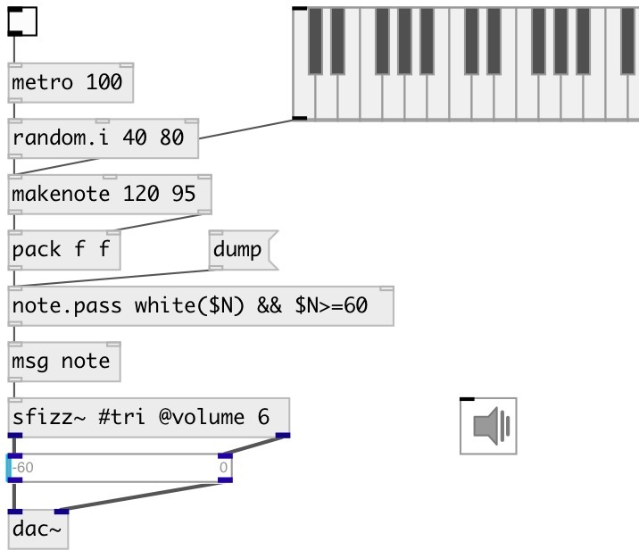

[index](index.html) :: [midi](category_midi.html)
---

# midi.note.pass
**aliases:** [note.pass]

###### midi note pass by expression

*available since version:* 0.9.7

---

## information
Passes midi notes (list of PITCH VELOCITY DUR?) for which expression returns true. Available variables: $N - MIDI note, $V - MIDI velocity Available functions: white(NOTE), black(NOTE), oct(NOTE), abs(X), sqrt(X) Available math operations: +,-,*,/,%,^,==,!=,&gt;,&gt;=,&lt;,&lt;=, &amp;&amp;,|| see for more information:

## arguments:

* **EXPR**
init expression 
_type:_ list 

## properties:

* **@expr** 
Get/set expression 
_type:_ list 

## inlets:

* NOTE VELOCITY [DUR] list 
_type:_ control
* set new expression 
_type:_ control

## outlets:

* passed NOTE VELOCITY [DUR] list 
_type:_ control

## keywords:

[midi](keywords/midi.html)
[expression](keywords/expression.html)
[pass](keywords/pass.html)

**See also:**
[\[expr\]](expr.html)

**Authors:** Serge Poltavsky

**License:** GPL3 or later

