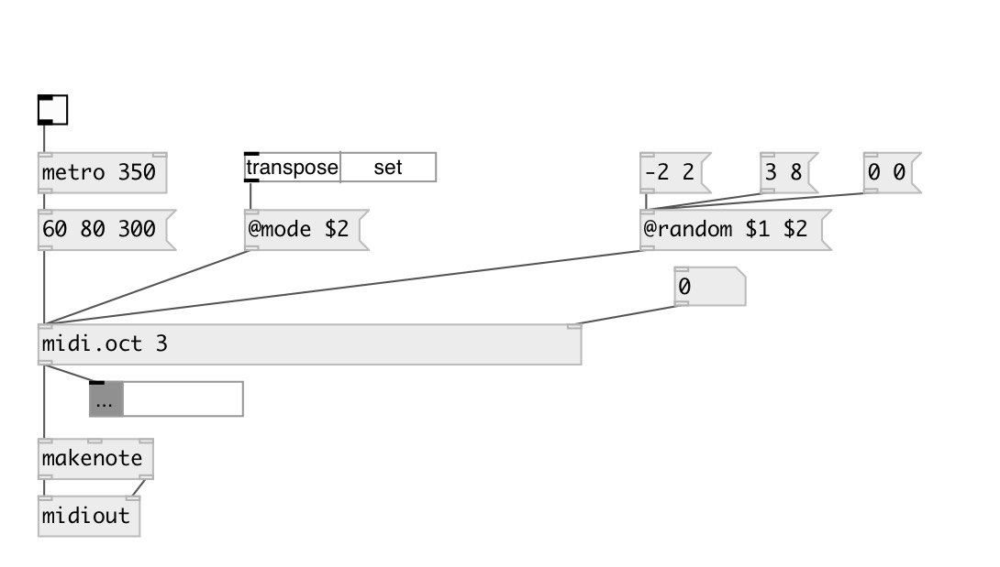

[index](index.html) :: [midi](category_midi.html)
---

# midi.oct

###### midi octave transpose

*available since version:* 0.9.2

---

## arguments:

* **OCT**
octave transposition 
_type:_ int 

## properties:

* **@mode** 
Get/set octave mode 
_type:_ symbol 
_enum:_ transpose, set 
_default:_ transpose 

* **@oct** 
Get/set octave transposition 
_type:_ int 
_range:_ -11..11 
_default:_ 0 

* **@random** 
Get/set random octave range. Arguments are: MIN MAX. 
_type:_ list 

* **@set** 
Get/set alias to @mode set 
_type:_ alias 

* **@transpose** 
Get/set alias to @mode transpose 
_type:_ alias 

## inlets:

* note value 
_type:_ control
* set @oct value 
_type:_ control

## outlets:

* transposed NOTE VELOCITY [DUR] list 
_type:_ control

## keywords:

[midi](keywords/midi.html)
[octave](keywords/octave.html)
[transpose](keywords/transpose.html)

**Authors:** Serge Poltavsky

**License:** GPL3 or later

