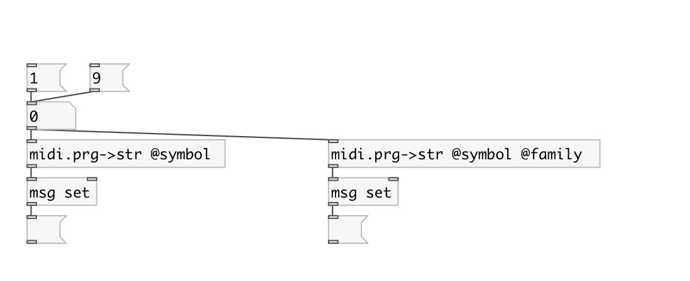

[< reference home](index.html)
---

# midi.prg2str

convert GM Instrument number to name (string or symbol)

---

 

---

---
arguments:

---
properties:

@symbol: output as symbol instead of string by
            default 
@family: output family name instead of instrument
            name 

