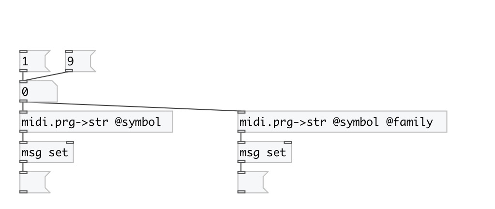

[index](index.html) :: [midi](category_midi.html)
---

# midi.prg2str

###### convert GM Instrument number to name (string or symbol)

*available since version:* 0.4

---

## properties:

* **@symbol** 
Get/set output as symbol instead of string by default 
__type:__ flag 
__default:__ 0 

* **@family** 
Get/set output family name instead of instrument name 
__type:__ flag 
__default:__ 0 

## inlets:

* General MIDI instrument number [1-128] 
__type:__ control 

## outlets:

* output General MIDI instrument name (string or symbol)
__type:__ control 

## keywords:

[midi](keywords/midi.html)
[convert](keywords/convert.html)
[midi](keywords/midi.html)

**Authors:** Serge Poltavsky

**License:** GPL3 or later

