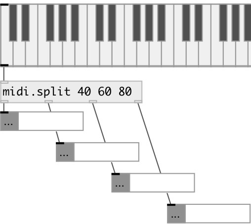

[index](index.html) :: [midi](category_midi.html)
---

# midi.split

###### midi note splitter

*available since version:* 0.9.5

---

## information
Split midi note messages at specified pitch values

## arguments:

* **NOTES**
list of note values (split points) 
_type:_ list 

## properties:

* **@points** (readonly)
Get split points. Should be in strict ascending order 
_type:_ list 

## inlets:

* NOTE VELOCITY [DUR] list 
_type:_ control

## outlets:

* midi pitches that are less than first split point 
_type:_ control
* ... 
_type:_ control
* midi pitches that are greater or equal than N-th split point and less then N+1 
_type:_ control
* notes that are greater or equal last split point 
_type:_ control

## keywords:

[midi](keywords/midi.html)
[note](keywords/note.html)
[splitter](keywords/splitter.html)

**Authors:** Serge Poltavsky

**License:** GPL3 or later

