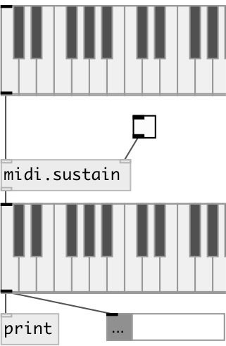

[index](index.html) :: [midi](category_midi.html)
---

# midi.sustain

###### sustain pedal emulation

*available since version:* 0.9.3

---

## information
when pedal is on: ignore all note offs when pedal is off: output all sustained notes off

## arguments:

* **STATE**
initial state 
_type:_ int 

## properties:

* **@on** 
Get/set pedal state 
_type:_ bool 
_default:_ 0 

* **@ctlin** 
Get/set listen to CTL64 from MIDI controller 
_type:_ bool 
_default:_ 0 

## inlets:

* MIDI input: NOTE VEL 
_type:_ control
* turn sustain on/off (1/0) 
_type:_ control

## outlets:

* MIDI output: NOTE VEL 
_type:_ control

## keywords:

[midi](keywords/midi.html)
[sustain](keywords/sustain.html)

**Authors:** Serge Poltavsky

**License:** GPL3 or later

