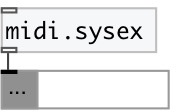

[index](index.html) :: [midi](category_midi.html)
---

# midi.sysex

###### sysex input messages as list

*available since version:* 0.9.2

---

## methods:

* **reset**
reset internal parser state 

## inlets:

* control input 
_type:_ control

## outlets:

* list of sysex bytes 
_type:_ control

## keywords:

[midi](keywords/midi.html)
[sysexin](keywords/sysexin.html)

**Authors:** Serge Poltavsky

**License:** GPL3 or later

