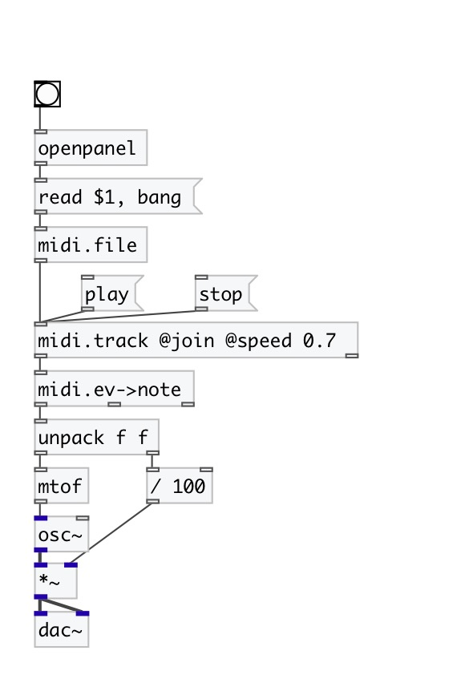

[< reference home](index.html)
---

# midi.track

extract track from MidiFile

---

 

---

---
arguments:

---
properties:

@track: track
            number 
@join: join all tracks into one 
@speed: play speed
            factor 
@tempo: current tempo in
            TPQ 

