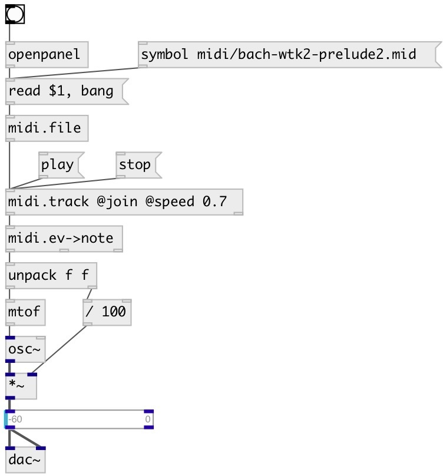

[index](index.html) :: [midi](category_midi.html)
---

# midi.track

###### extract track from MidiFile

*available since version:* 0.4

---

## methods:

* **play**
start playing 

* **pause**
pause playing 

* **stop**
stop playing 

* **next**
moves playing position to next event. No output 

* **reset**
set current event index to zero 

* **seek**
seek to specified tick 

## properties:

* **@track** 
Get/set track number 
_type:_ int 
_min value:_ 0 
_default:_ 0 

* **@join** 
Get/set join all tracks into one 
_type:_ flag 
_default:_ 0 

* **@speed** 
Get/set play speed factor 
_type:_ float 
_min value:_ 0.01 
_default:_ 1 

* **@tempo** (readonly)
Get current tempo in TPQ 
_type:_ int 
_default:_ 120 

* **@current** (readonly)
Get current event tick index 
_type:_ int 
_default:_ 0 

* **@nevents** (readonly)
Get number of events in track 
_type:_ int 
_default:_ 0 

* **@state** (readonly)
Get current state. 0: stopped, 1: playing, 2: paused 
_type:_ int 
_enum:_ 0, 1, 2 
_default:_ 0 

## inlets:

* method inlet 
_type:_ control

## outlets:

* outputs MidiEvent message 
_type:_ control
* time in milliseconds until next MIDI event 
_type:_ control

## keywords:

[midi](keywords/midi.html)
[track](keywords/track.html)

**Authors:** Serge Poltavsky

**License:** GPL3 or later

