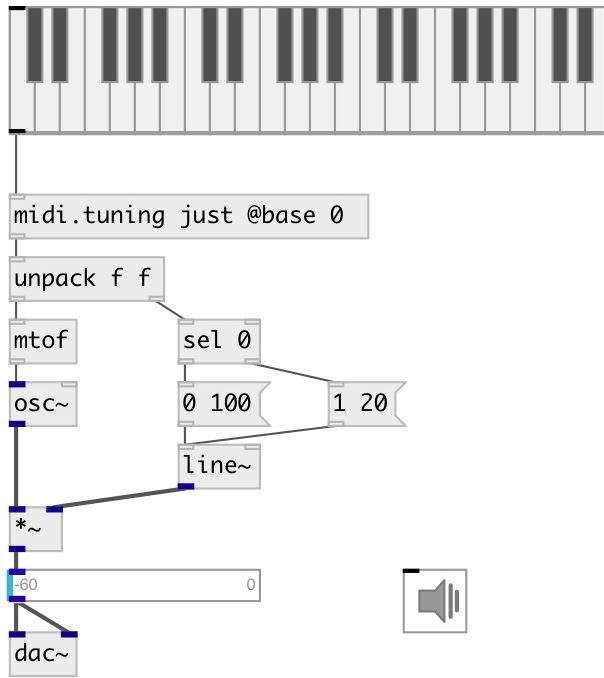

[index](index.html) :: [midi](category_midi.html)
---

# midi.tuning

###### apply tuning to midi messages

*available since version:* 0.9.1

---

## arguments:

* **DEV**
if symbol - set named temperament deviations, valid names are: &#34;eq&#34;, &#34;just&#34;,
&#34;ganassi&#34;, &#34;meantone&#34;, &#34;kirnberger3&#34;, &#34;pythagorean&#34;, &#34;rameau&#34;, &#34;valotti&#34; or
&#34;zarlino&#34;. If list: set deviation in cents per pitch 
_type:_ list 

## properties:

* **@base** 
Get/set base pitch (C: 0, A: 9, etc..) 
_type:_ int 
_range:_ 0..11 
_default:_ 9 

* **@dev** 
Get/set list of deviations in cents 
_type:_ list 
_default:_ 0 0 0 0 0 0 0 0 0 0 0 0 

## inlets:

* NOTE VELOCITY pair expected 
_type:_ control

## outlets:

* note velocity pair 
_type:_ control

## keywords:

[midi](keywords/midi.html)
[tuning](keywords/tuning.html)

**Authors:** Serge Poltavsky

**License:** GPL3 or later

