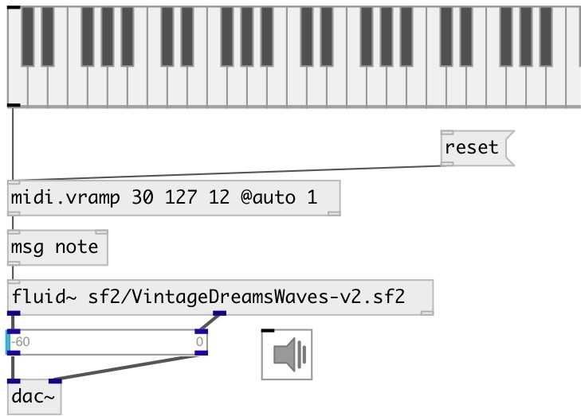

[index](index.html) :: [midi](category_midi.html)
---

# midi.vramp

###### apply crescendo or diminuendo for midi message flow

*available since version:* 0.9.1

---

## arguments:

* **FROM**
start value 
__type:__ int 

* **TO**
end value 
__type:__ int 

* **N**
number of steps 
__type:__ int 

## methods:

* **reset**
reset to start value 

## properties:

* **@from** 
Get/set start value 
__type:__ int 
__range:__ 0..127 
__default:__ 127 

* **@to** 
Get/set end value 
__type:__ int 
__range:__ 0..127 
__default:__ 127 

* **@n** 
Get/set number of steps 
__type:__ int 
__min value:__ 0 
__default:__ 0 

* **@auto** 
Get/set auto reset mode. If true: reset to @start value after ramp is finished 
__type:__ int 
__enum:__ 0, 1 
__default:__ 0 

## inlets:

* if VALUE &gt;0, treat as (VALUE 127) list, otherwise as (-VALUE,
                0) 
__type:__ control 

## outlets:

* outputs NOTE VELOCITY pair
__type:__ control 
* bang when destination value is reached
__type:__ control 

## keywords:

[midi](keywords/midi.html)
[ramp](keywords/ramp.html)
[crescendo](keywords/crescendo.html)
[diminuendo](keywords/diminuendo.html)

**Authors:** Serge Poltavsky

**License:** GPL3 or later

