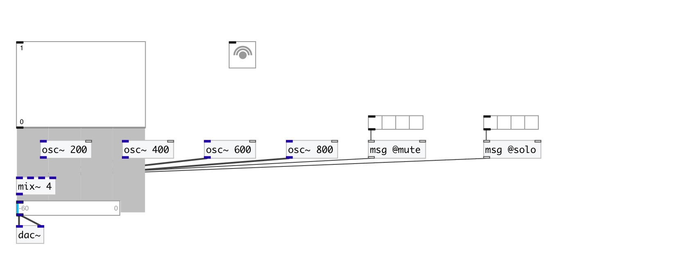

[< reference home](index.html)
---

# mix~

multislot signal mixer

---

 

---

---
arguments:

N: number of inputs 

---
properties:

@xfade_time(ms): smooth time 
@value: linear amplitude
            values 
@db(db): 
            amplitude values in decibels 
@mute: mute channel
            list 
@solo: solo channel
            list 

